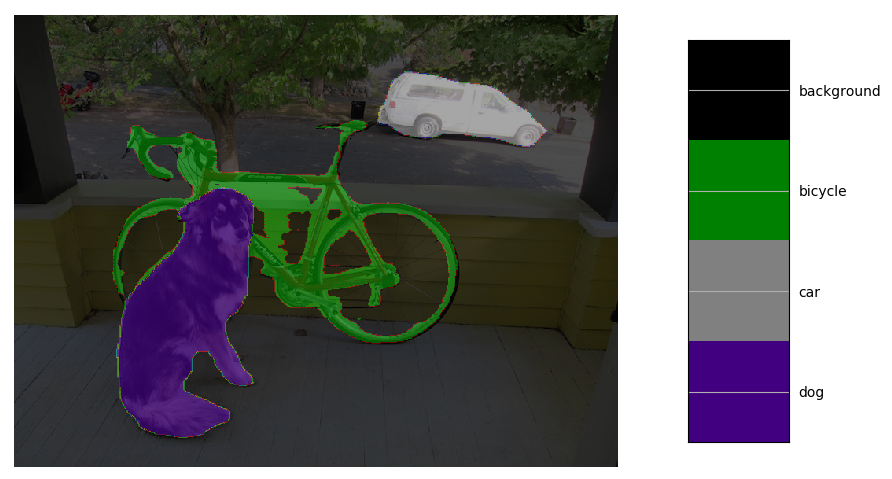
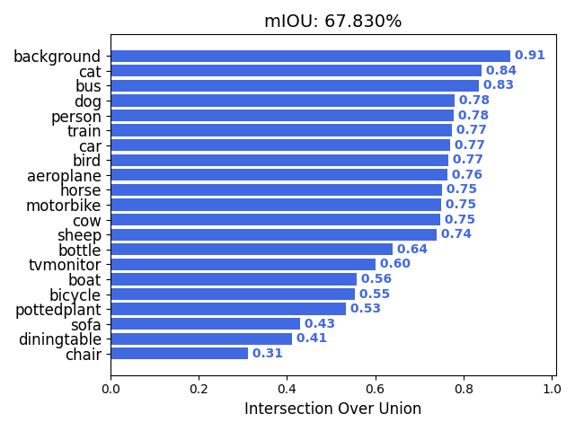
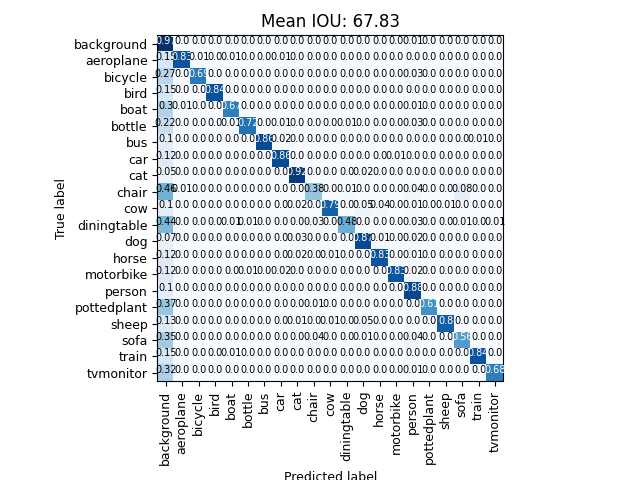

# TF Keras DeepLab v3+ Modelset

## Introduction

An end-to-end semantic segmentation pipeline with DeepLabv3+ models. Implement with tf.keras, including data collection/annotation, model training/tuning, model evaluation and on device deployment. Support different backbones and different head architecture:

#### Backbone
- [x] Xception
- [x] ResNet50
- [x] MobileNetV2
- [x] MobilenetV3(Large/Small)

#### Head
- [x] ASPP
- [x] ASPP Lite(Only Global Pooling + 1x1 Conv)
- [x] Decoder
- [x] Different Output Stride(8/16/32)

#### Loss
- [x] Categorical Cross Entropy Loss
- [x] Balanced Class Weighted Cross Entropy Loss
- [x] Adaptive Class Weighted Cross Entropy Loss
- [x] Focal Loss

#### Postprocess
- [x] Numpy CRF (Conditional Random Fields) postprocess implementation


#### Train tech
- [x] Transfer training from Imagenet/PascalVOC
- [x] Dynamic learning rate decay (Cosine/Exponential/Polynomial/PiecewiseConstant)
- [x] GridMask data augmentation ([paper](https://arxiv.org/abs/2001.04086))
- [x] Multi-GPU training with SyncBatchNorm support (valid for TF-2.2 and later)

#### On-device deployment
- [x] Tensorflow-Lite Float32/UInt8 model inference
- [x] MNN Float32/UInt8 model inference


## Quick Start

1. Install requirements on Ubuntu 16.04/18.04:

```
# pip install -r requirements.txt
```

2. Download Deeplabv3+ PascalVOC pretrained weights. It's provided by [keras-deeplab-v3-plus](https://github.com/bonlime/keras-deeplab-v3-plus) and imported from [original TF checkpoint](https://github.com/tensorflow/models/tree/master/research/deeplab)
3. Run Deeplab segmentation on your image or video.

```
# wget -O weights/deeplabv3_xception_tf_dim_ordering_tf_kernels.h5 https://github.com/bonlime/keras-deeplab-v3-plus/releases/download/1.1/deeplabv3_xception_tf_dim_ordering_tf_kernels.h5
# python deeplab.py --model_type=xception --weights_path=weights/deeplabv3_xception_tf_dim_ordering_tf_kernels.h5 --classes_path=configs/voc_classes.txt --output_stride=16 --image
# python deeplab.py --model_type=xception --weights_path=weights/deeplabv3_xception_tf_dim_ordering_tf_kernels.h5 --classes_path=configs/voc_classes.txt --output_stride=16 --input=<your video file>

```

Image segment sample:

<p align="center">
  
</p>


## Guide of train/evaluate/demo

### Train

1. Prepare dataset
    1. PascalVOC2012 & SBD (VOC2012 train_aug) semantic segmentation dataset
        * Run a simple script to download, convert & merge PascalVOC 2012 and SBD

            ```
            # pushd tools/dataset_converter/voc_augment/
            # ./dataset_prepare.sh
            # popd

            ```
       dataset images & labels will be placed at `VOC2012/`

    2. MS COCO 2017 segmentation dataset
        * Run a simple script to download COCO2017 dataset, and convert annotated instance mask to PNG format semantic segmentation label image:

            ```
            # pushd tools/dataset_converter/mscoco2017/
            # ./dataset_prepare.sh
            # popd

            ```
       You can dig into related script for details. Dataset images & labels will be placed at `mscoco2017/`

    3. Customized semantic segmentation dataset
        * Collecting target JPG format images and place at `<dataset_path>/images`
        * Generate semantic segmentation label image. You can use [labelme](https://github.com/wkentaro/labelme) to annotate your image with polygonal segmentation mask and save to a json file. Then run [json_to_dataset.py](https://github.com/david8862/tf-keras-deeplabv3p-model-set/blob/master/tools/dataset_converter/labelme/json_to_dataset.py) to convert json annotations to PascalVOC style PNG format label images:
            ```
            # cd tools/dataset_converter/labelme && python json_to_dataset.py -h
              usage: json_to_dataset.py [-h] --json_file_path JSON_FILE_PATH
                                        [--classes_path CLASSES_PATH] --png_label_path
                                        PNG_LABEL_PATH

              convert labelme json label to voc png label

              optional arguments:
                -h, --help            show this help message and exit
                --json_file_path JSON_FILE_PATH
                                      path to labelme annotated json label files
                --classes_path CLASSES_PATH
                                      path to class definitions,
                                      default=../../../configs/voc_classes.txt
                --png_label_path PNG_LABEL_PATH
                                      output path of converted png label images
            ```

            For class names file format, refer to  [voc_classes.txt](https://github.com/david8862/tf-keras-deeplabv3p-model-set/blob/master/configs/voc_classes.txt).

        * Place the PNG label images at `<dataset_path>/labels`
        * Create PascalVOC style dataset split (train/val/test) txt files. One line for a image and only include image base name, like:
            ```
            2007_000033
            2007_000042
            2007_000061
            ...
            ```

            You can put these dataset files together at `<dataset_path>` to create an independent dataset directory


2. [train.py](https://github.com/david8862/tf-keras-deeplabv3p-model-set/blob/master/train.py)
```
# python train.py -h
usage: train.py [-h] [--model_type MODEL_TYPE] [--weights_path WEIGHTS_PATH]
                [--model_input_shape MODEL_INPUT_SHAPE]
                [--output_stride {8,16,32}] [--dataset_path DATASET_PATH]
                [--dataset_file DATASET_FILE]
                [--val_dataset_file VAL_DATASET_FILE] [--val_split VAL_SPLIT]
                [--classes_path CLASSES_PATH] [--batch_size BATCH_SIZE]
                [--optimizer {adam,rmsprop,sgd}] [--loss {crossentropy,focal}]
                [--weighted_type {None,adaptive,balanced}]
                [--learning_rate LEARNING_RATE]
                [--decay_type {None,cosine,exponential,polynomial,piecewise_constant}]
                [--transfer_epoch TRANSFER_EPOCH] [--freeze_level {0,1,2}]
                [--init_epoch INIT_EPOCH] [--total_epoch TOTAL_EPOCH]
                [--gpu_num GPU_NUM] [--model_pruning] [--eval_online]
                [--eval_epoch_interval EVAL_EPOCH_INTERVAL]
                [--save_eval_checkpoint]

optional arguments:
  -h, --help            show this help message and exit
  --model_type MODEL_TYPE
                        DeepLabv3+ model type:
                        mobilenetv2/mobilenetv2_lite/xception,
                        default=mobilenetv2_lite
  --weights_path WEIGHTS_PATH
                        Pretrained model/weights file for fine tune
  --model_input_shape MODEL_INPUT_SHAPE
                        model image input shape as <height>x<width>,
                        default=512x512
  --output_stride {8,16,32}
                        model output stride, default=16
  --dataset_path DATASET_PATH
                        dataset path containing images and label png file,
                        default=VOC2012/
  --dataset_file DATASET_FILE
                        train samples txt file,
                        default=VOC2012/ImageSets/Segmentation/trainval.txt
  --val_dataset_file VAL_DATASET_FILE
                        val samples txt file, default=None
  --val_split VAL_SPLIT
                        validation data persentage in dataset if no val
                        dataset provide, default=0.1
  --classes_path CLASSES_PATH
                        path to class definitions,
                        default=configs/voc_classes.txt
  --batch_size BATCH_SIZE
                        batch size for training, default=16
  --optimizer {adam,rmsprop,sgd}
                        optimizer for training (adam/rmsprop/sgd),
                        default=adam
  --loss {crossentropy,focal}
                        loss type for training (crossentropy/focal),
                        default=crossentropy
  --weighted_type {None,adaptive,balanced}
                        class balance weighted type, default=None
  --learning_rate LEARNING_RATE
                        Initial learning rate, default=0.001
  --decay_type {None,cosine,exponential,polynomial,piecewise_constant}
                        Learning rate decay type, default=None
  --transfer_epoch TRANSFER_EPOCH
                        Transfer training stage epochs, default=5
  --freeze_level {0,1,2}
                        Freeze level of the model in transfer training stage.
                        0:NA/1:backbone/2:only open prediction layer
  --init_epoch INIT_EPOCH
                        initial training epochs for fine tune training,
                        default=0
  --total_epoch TOTAL_EPOCH
                        total training epochs, default=150
  --gpu_num GPU_NUM     Number of GPU to use, default=1
  --model_pruning       Use model pruning for optimization, only for TF 1.x
  --eval_online         Whether to do evaluation on validation dataset during
                        training
  --eval_epoch_interval EVAL_EPOCH_INTERVAL
                        Number of iteration(epochs) interval to do evaluation,
                        default=10
  --save_eval_checkpoint
                        Whether to save checkpoint with best evaluation result
```

Following is a reference config cmd for training mobilenetv2 lite model on PascalVOC2012 & SBD dataset:
```
# python train.py --model_type=mobilenetv2_lite --output_stride=16 --dataset_path=VOC2012/ --dataset_file=VOC2012/ImageSets/Segmentation/train.txt --val_dataset_file=VOC2012/ImageSets/Segmentation/val.txt --batch_size=16 --freeze_level=1 --transfer_epoch=5 --total_epoch=100 --eval_online --eval_epoch_interval=1 --save_eval_checkpoint --weighted_type=adaptive
```

Checkpoints during training could be found at `logs/000/`. Choose a best one as result

You can also use Tensorboard to monitor the loss trend during train:
```
# tensorboard --logdir=logs/000
```

MultiGPU usage: use `--gpu_num N` to use N GPUs. It use [tf.distribute.MirroredStrategy](https://www.tensorflow.org/guide/distributed_training#mirroredstrategy) to support MultiGPU environment.


### Model dump
We' better to dump out inference model from training checkpoint for eval or demo. Following script cmd work for that.

```
# python deeplab.py --model_type=mobilenetv2_lite --weights_path=logs/000/<checkpoint>.h5 --classes_path=configs/voc_classes.txt --model_input_shape=512x512 --output_stride=16 --dump_model --output_model_file=model.h5
```

Change model_type, input shape & output stride to get different inference model. If "--model_pruning" was added in training, you also need to use "--pruning_model" here for dumping out the pruned model.

NOTE: One trained model could be dump out for different input shape & output stride (of course with different accuracy performance).


### Evaluation
Use [eval.py](https://github.com/david8862/tf-keras-deeplabv3p-model-set/blob/master/eval.py) to do evaluation on the inference model with your test data. It will calculate following metrics:

* mIOU
* FWIOU (Frequency Weighted IOU)
* PA (Pixel Accuracy)
* MPA (Mean Pixel Accuracy)

It will also draw confusion matrix chart and IOU result for each class under "result" dir, and optionally save all the segmentation result images & predicted PNG labels for checking.

```
# python eval.py --model_path=model.h5 --dataset_path=VOC2012/ --dataset_file=VOC2012/ImageSets/Segmentation/val.txt --classes_path=configs/voc_classes.txt --model_input_shape=512x512 --save_result
```

If you enable "--eval_online" option in train.py, evaluation on validation dataset will be executed during training. But that may cost more time for train process.


Following is a sample result trained on MobilenetV2_Lite model with VOC2012+SBD dataset:
<p align="center">
  
  
</p>


Some experiment on VOC2012+SBD dataset and comparison:

| Model type | InputSize | Output Stride | TrainSet | TestSet | mIOU | FLOPS | Param | Speed | Ps |
| ----- | ------ | ------ | ------ | ----- | ----- | ----- | ----- | ----- | ----- |
| [ResNet50](https://github.com/david8862/tf-keras-deeplabv3p-model-set/releases/download/1.0.1/deeplabv3p_resnet50_512_os16_voc.tar.gz) | 512x512 | 16 | VOC12&SBD train | VOC12&SBD val | 73.71% | 73.95G | 26.72M | 38ms | Keras on Titan XP |
| [MobileNetV3Large](https://github.com/david8862/tf-keras-deeplabv3p-model-set/releases/download/1.0.1/deeplabv3p_mobilenetv3large_512_os16_voc.tar.gz) | 512x512 | 16 | VOC12&SBD train | VOC12&SBD val | 72.33% | 9.52G | 3.51M | 29ms | Keras on Titan XP |
| [MobileNetV2 Lite](https://github.com/david8862/tf-keras-deeplabv3p-model-set/releases/download/1.0.0/deeplabv3p_mobilenetv2_lite_512_os16_voc.tar.gz) | 512x512 | 16 | VOC12&SBD train | VOC12&SBD val | 67.83% | 5.24G | 2.11M | 23ms | Keras on Titan XP |
| [MobileNetV3Small Lite](https://github.com/david8862/tf-keras-deeplabv3p-model-set/releases/download/1.0.1/deeplabv3p_mobilenetv3small_lite_512_os16_voc.tar.gz) | 512x512 | 16 | VOC12&SBD train | VOC12&SBD val | 64.81% | 1.36G | 1.06M | 20ms | Keras on Titan XP |


### Demo
1. [deeplab.py](https://github.com/david8862/tf-keras-deeplabv3p-model-set/blob/master/deeplab.py)
> * Demo script for trained model

image inference mode
```
# python deeplab.py --model_type=mobilenetv2_lite --weights_path=model.h5 --classes_path=configs/voc_classes.txt --model_input_shape=512x512 --output_stride=16 --image
```
video inference mode
```
# python deeplab.py --model_type=mobilenetv2_lite --weights_path=model.h5 --classes_path=configs/voc_classes.txt --model_input_shape=512x512 --output_stride=16 --input=test.mp4
```
For video detection mode, you can use "input=0" to capture live video from web camera and "output=<video name>" to dump out inference result to another video

### Tensorflow model convert
Using [keras_to_tensorflow.py](https://github.com/david8862/tf-keras-deeplabv3p-model-set/blob/master/tools/model_converter/keras_to_tensorflow.py) to convert the tf.keras .h5 model to tensorflow frozen pb model (only for TF 1.x):
```
# python keras_to_tensorflow.py
    --input_model="path/to/keras/model.h5"
    --output_model="path/to/save/model.pb"
```

### ONNX model convert
Using [keras_to_onnx.py](https://github.com/david8862/tf-keras-deeplabv3p-model-set/blob/master/tools/model_converter/keras_to_onnx.py) to convert the tf.keras .h5 model to ONNX model:
```
### need to set environment TF_KERAS=1 for tf.keras model
# export TF_KERAS=1
# python keras_to_onnx.py
    --keras_model_file="path/to/keras/model.h5"
    --output_file="path/to/save/model.onnx"
    --op_set=11
```

You can also use [eval.py](https://github.com/david8862/tf-keras-deeplabv3p-model-set/blob/master/eval.py) to do evaluation on the pb & onnx inference model

### Inference model deployment
See [on-device inference](https://github.com/david8862/tf-keras-deeplabv3p-model-set/blob/master/inference) for TFLite & MNN model deployment


### TODO
- [ ] support model pruning
- [ ] support SubPixel predict layer
- [ ] support Quantization aware training


## Some issues to know
1. The test environment is
    - Ubuntu 16.04/18.04
    - Python 3.6.8
    - tensorflow 2.0.0/tensorflow 1.15.0
    - tf.keras 2.2.4-tf

2. Imagenet pretrained weights for backbone is automatically loaded (if have) when training, so recommended to freeze backbone layers for several epochs in transfer traning stage.

3. Training strategy is for reference only. Adjust it according to your dataset and your target. And add further strategy if needed.


## Contribution guidelines
New features, improvements and any other kind of contributions are warmly welcome via pull request :)


# Citation
Please cite tf-keras-deeplabv3p-model-set in your publications if it helps your research:
```
@article{Keras-segmentation-deeplab-v3.1,
     Author = {Jenia Golbstein},
     Year = {2019}
}
@article{pytorch-deeplab-xception,
     Author = {jfzhang95},
     Year = {2019}
}

@article{Focal Loss,
     title={Focal Loss for Dense Object Detection},
     author={Tsung-Yi Lin, Priya Goyal, Ross Girshick, Kaiming He, Piotr Dollár},
     journal = {arXiv},
     year={2017}
}

```
